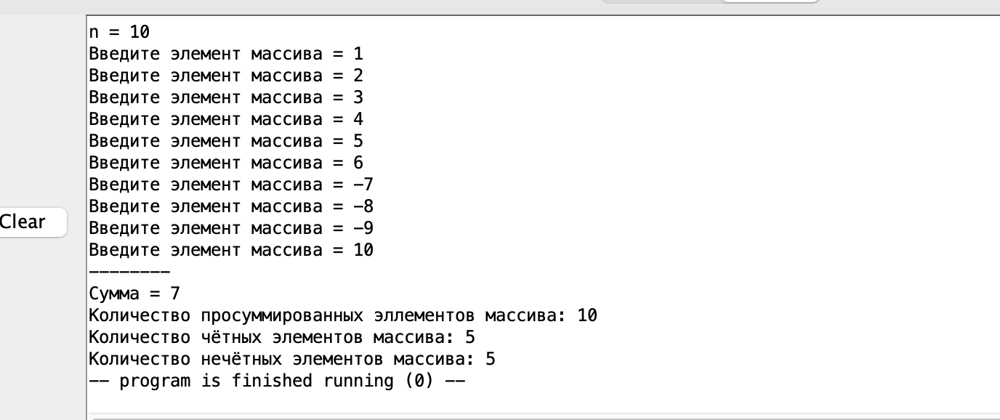
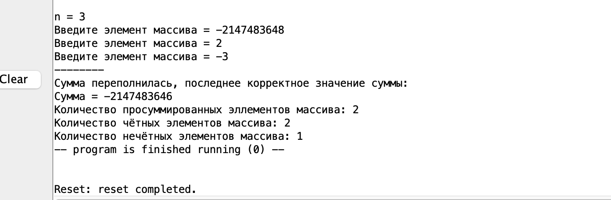
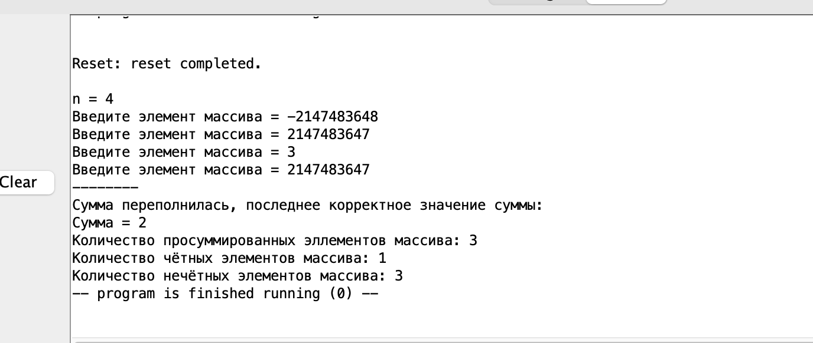
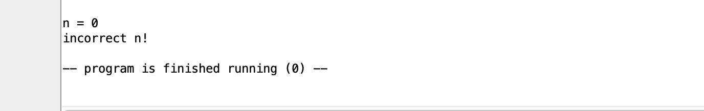

```assembly
.data
n:    .asciz     "n = "
error:    .asciz     "incorrect n!\n"
sum:      .asciz     "Сумма = "
count1:    .asciz    "Количество просуммированных эллементов массива: "
count2:    .asciz    "Количество нечётных элементов массива: "
count3:    .asciz    "Количество чётных элементов массива: "
arg01:    .asciz    "Сумма переполнилась, последнее корректное значение суммы:"
arg02:     .asciz    "Введите элемент массива = "
sep:    .asciz  "--------\n"   
.align  2                 
array:  .space  64
.text   
        la     a0 n
        li     a7 4
        ecall
        li      a7 5
        ecall
        mv      t3 a0
        ble     t3 zero fail
        li      t4 10
        bgt     t3 t4 fail
        la      t0 array
        li    s1 0
        mv    s1 t3
        li    t1 0
        mv    t2 t3
fill:    
        la    a0 arg02
        li    a7 4
        ecall
        li    a7 5
        ecall
        sw    a0 (t0)
        addi    t0 t0 4
        addi    t2 t2 -1
        bnez    t2 fill
        la      a0 sep
        li      a7 4
        ecall
        li    t2 0
        li    t5 0
        la      t0 array
out:
        lw    a0 (t0)
        bgez    a0 elem_greater_or_equal_0
        j    else
cont01:
        add    t1 t1 a0
cont02:
        addi    t0 t0 4
        addi    t2 t2 1
        blt     t2 s1 out
end_without_even_odd:
        la     a0 sum
        li     a7 4
        ecall
        mv    a0 t1
        li     a7 1
        ecall
        li      a7 11
        li      a0 10
        ecall
        la     a0 count1
        li     a7 4
        ecall
        mv    a0 t2
        li     a7 1
        ecall
        li      a7 11
        li      a0 10
        ecall
        la    t0 array
        j    t0_0
elem_greater_or_equal_0:
        blez     t1 cont01
        li    t6 0
        add    t6 t1 a0
        bge    t1 t6 overflow
        mv    t1 t6
        j    cont02
else:
        bgez    t1 cont01
        li    t6 0
        add    t6 t1 a0
        ble    t1 t6 overflow
        mv    t1 t6
        j    cont02
overflow:
        la     a0, arg01
        li     a7, 4
        ecall
        li      a7 11
        li      a0 10
        ecall
        j    end_without_even_odd
fail:
        la     a0 error
        li     a7 4
        ecall
        li      a7 10
        ecall
t0_0:
        beqz    t2 even_odd
        li    t1 1
        li    t6 4
        sub    t4 t4 t6
        sub    t2 t2 t1
        j    t0_0
even_odd:        
        lw    a0 (t0)
        li    t6 0
        andi    t6 a0 1
        beq    zero t6 even
cont_ev_od:
        addi    t0 t0 4
        addi    t2 t2 1
        blt     t2 s1 even_odd
end:
        la     a0 count3
        li     a7 4
        ecall
        mv    a0 t5
        li     a7 1
        ecall
        li      a7 11
        li      a0 10
        ecall
        la     a0 count2
        li     a7 4
        ecall
        sub    t5 t3 t5
        mv    a0 t5
        li     a7 1
        ecall
        li      a7 10
        ecall
even:
        addi    t5 t5 1
        j    cont_ev_od
```

Возможные случаи работы программы:
* Обычная работа


* Переполнение вниз


* Переполнение вверх


* Размер больше 10


* Размер равен 0


* Размер меньше 0

